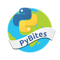

# PyBites

[Challenges](https://pybit.es/pages/challenges.html) for Python Programming from [PyBites](https://pybit.es/).

**Progress**: 

**Finished Challenges**

:heavy_check_mark: [Code Challenge 01 - Word Values Part I](https://github.com/Carlosma7/PyBites-Challenge/tree/main/01)

:heavy_check_mark: [Code Challenge 02 - Word Values Part II - A Simple Game](https://github.com/Carlosma7/PyBites-Challenge/tree/main/02)
